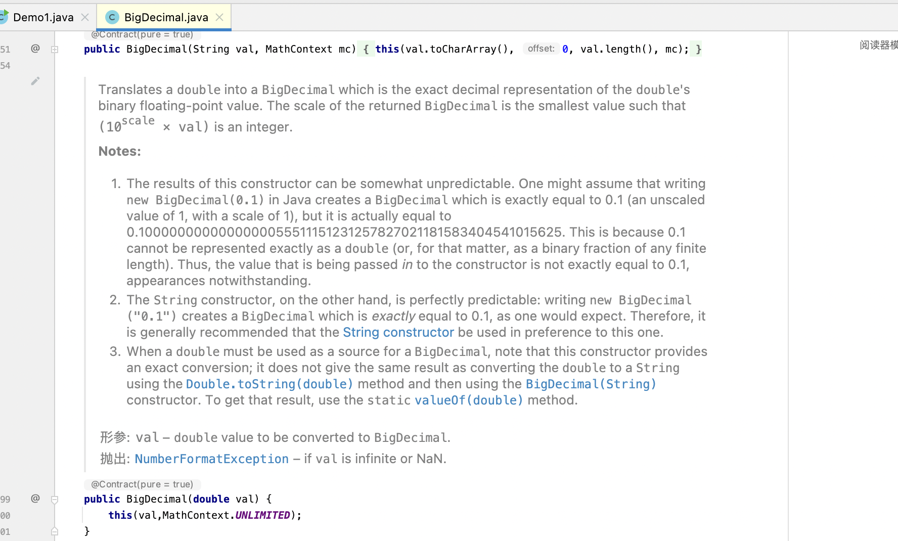

BigDecimal使用详解

<!-- more -->

##### 为什么要使用BigDecimal

示例：

```java
public class Demo1 {
    public static void main(String[] args) {
        System.out.println(0.1 + 0.2);
        System.out.println(0.3 - 0.1);
        System.out.println(0.2 * 0.1);
        System.out.println(0.3 / 0.1);
    }
}                 
```


在计算机中，浮点数(float和double)都是采用二进制表示的。但是二进制无法精确地表示所有的十进制小数，这就导致了浮点数在某些情况下会出现精度丢失的问题。 例如，十进制的0.1并不能精确地表示为二进制数。用float或double类型表示0.1时，实际上是一个近似值，而不是精确值。当进行一系列复杂的浮点数运算时，这种近似值的误差会逐渐累积，导致最终结果的精度下降，出现精度丢失的问题。 此外，float和double类型在内存中的存储方式也会导致精度丢失。float类型占4个字节，double类型占8个字节，这意味着它们能够表示的数值范围和精度都是有限的。当需要表示的数值超出了其范围时，也会出现精度丢失的问题。 因此，在进行浮点数运算时，应该注意精度丢失的问题，尽可能地减小误差的累积，避免影响到最终结果的准确性。

##### BigDecimal是什么

Java在java.math包中提供的API类BigDecimal，用来对超过16位有效位的数进行精确的运算。双精度浮点型变量double可以处理16位有效数。在实际应用中，需要对更大或者更小的数进行运算和处理。float和double只能用来做科学计算或者是工程计算，在商业计算中要用java.math.BigDecimal。BigDecimal所创建的是对象，我们不能使用传统的+、-、*、/等算术运算符直接对其对象进行数学运算，而必须调用其相对应的方法。方法中的参数也必须是BigDecimal的对象。构造器是类的特殊方法，专门用来创建对象，特别是带有参数的对象。
##### BigDecimal构造器

| 构造器             | 描述                                                       |
| ------------------ | ---------------------------------------------------------- |
| BigDecimal(int)    | 创建一个具有参数所指定整数值的对象。                       |
| BigDecimal(double) | 创建一个具有参数所指定双精度值的对象。 //不推荐使用        |
| BigDecimal(long)   | 创建一个具有参数所指定长整数值的对象。                     |
| BigDecimal(String) | 创建一个具有参数所指定以字符串表示的数值的对象。//推荐使用 |

###### 为什么不推荐使用`double`构造器创建BigDecimal对象

示例

```java
public class Demo1 {
    public static void main(String[] args) {
        BigDecimal c = new BigDecimal(1.2);
        System.out.println(c);
    }
}
```

结果


JDK源码注释



翻译

> 译文：将double转换为BigDecimal, BigDecimal是double的二进制浮点值的精确十进制表示。返回的BigDecimal的比例是最小的值(10规模Val)是整数。注:1. 这个构造函数的结果可能有些不可预测。人们可能会认为在Java中编写新的BigDecimal(0.1)会创建一个完全等于0.1的BigDecimal(一个未缩放的值1，缩放为1)，但实际上它等于0.1000000000000000055511151231257827021181583404541015625. 这是因为0.1不能精确地表示为双精度数(或者，就此而言，不能表示为任何有限长度的二进制分数)。因此，传递给构造函数的值并不完全等于0.1，尽管看起来是这样。2. 另一方面，String构造函数是完全可预测的:写入new BigDecimal("0.1")将创建一个完全等于0.1的BigDecimal，正如人们所期望的那样。因此，通常建议优先使用String构造函数。3.当必须使用double作为BigDecimal的源时，请注意此构造函数提供了精确的转换;它不会给出与使用double . tostring (double)方法然后使用BigDecimal(String)将double转换为String相同的结果。构造函数。要得到这个结果，使用静态valueOf(double)方法。Parameter: val -- double value to be converted to BigDecimal. Throws: NumberFormatException - if val is infinite or NaN.

另外，当你用了非字符串构造创建了一个BigDecimal对象时，如果进行了除运算，当结果有余数的时候会报`java.lang.ArithmeticException`这个异常

##### 使用

| 方法                   | 描述   |
| ---------------------- | ------ |
| add(BigDecimal augend) | 加法   |
| subtract(BigDecimal)   | *相减* |
| multiply(BigDecimal)   | 相乘   |
| divide(BigDecimal)     | 除法   |

##### 保留小数

<font color="red">在进行除法运算的时候，针对可能出现的小数产生的计算，必须要多传两个参数</font>

###### ROUND_CEILING    

//向正无穷方向舍入

###### ROUND_DOWN    

//向零方向舍入

###### ROUND_FLOOR   

 //向负无穷方向舍入

###### ROUND_HALF_DOWN   

 //向（距离）最近的一边舍入，除非两边（的距离）是相等,如果是这样，向下舍入, 例如1.55 保留一位小数结果为1.5

###### ROUND_HALF_EVEN  

  //向（距离）最近的一边舍入，除非两边（的距离）是相等,如果是这样，如果保留位数是奇数，使用ROUND_HALF_UP，如果是偶数，使用ROUND_HALF_DOWN

###### ROUND_HALF_UP   

 //向（距离）最近的一边舍入，除非两边（的距离）是相等,如果是这样，向上舍入, 1.55保留一位小数结果为1.6,也就是我们常说的“四舍五入”

###### ROUND_UNNECESSARY    

//计算结果是精确的，不需要舍入模式

###### ROUND_UP   

 //向远离0的方向舍入

