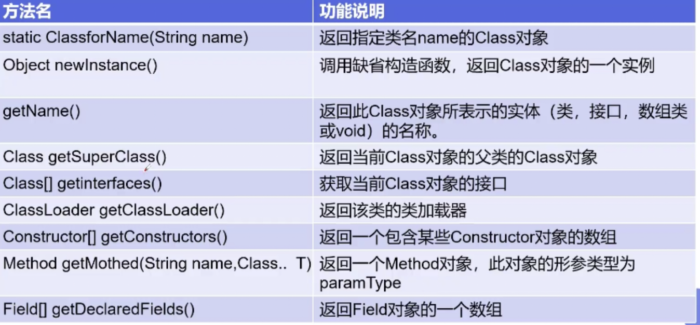
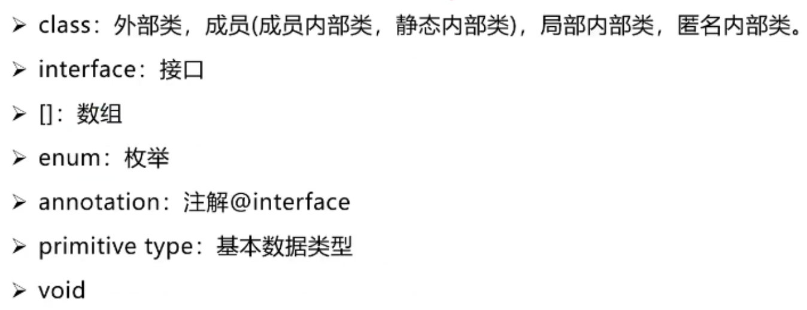

java反射详解

<!-- more -->

#### 一、反射的概念

##### 1.1动态语言跟静态语言

###### **动态语言**

是一种可以在运行时可以改变其结构的语言：例如新的函数、代码、对象可以被引进

例如：html，js，php，python等

###### 静态语言

与之相反，就是再运行时结构不可变的静态语言，例如java更改本地代码后你需要重新编译启动

例如：java、c、c++、

###### 准动态语言

严格来说java并不能算一种纯静态语言，因为java有一定的动态性。我们可以利用java反射的机制获得类似动态语言的特性。java的动态性让编程的时候变得更灵活

##### 1.2java的反射机制概念

Java 中的反射机制，就是在运行的时候，对于任何一个类，都可以知道这个类里面的所有属性和方法；对于任何一个对象，都可以调用这个对象里面的任意一个方法和属性。这种动态获取信息和动态调用对象方法的功能，就被称为 Java 中的反射机制

##### 1.3反射可以做什么


##### 1.4使用反射的好处跟缺点

**优点**：可以实现动态创建对象和编译，灵活性大大提高

**缺点：**对性能有影响。使用反射基本上是一种解释操作，这类操作慢于相同的直接执行

#### 二、class对象

##### 2.1获取class对象的几种方式

**<font color="red">注意：在运行期间，一个类，只有一个Class对象产生。</font>**

```java
public class GetReflection {
    public static void main(String[] args) throws ClassNotFoundException {
        //方式一 通过对象获取class对象
        GetReflection getReflection = new GetReflection();
        Class getReflectionClass1 = getReflection.getClass();
        System.out.println(getReflectionClass1.getName());

        //方式二 通过累的所在路径获取对象
        Class getReflectionClass2 = Class.forName("com.GetReflection");
        System.out.println(getReflectionClass2.getName());

        //方式三 通过类名 类名class
        Class getReflectionClass3 = GetReflection.class;
        System.out.println(getReflectionClass3.getName());
    }
}
```

##### 2.2class类常用的方法



##### 2.3那些类型可以获得class对象



```java
//所有类型的Class
public class Demo06_AllTypeClass {
    public static void main(String[] args) {
        Class c1 = Object.class; //类
        Class c2 = Comparable.class; //接口
        Class c3 = String[].class; //一维数组
        Class c4 = int[][].class; //二维数组
        Class c5 = Override.class; //注解
        Class c6 = ElementType.class; //美剧
        Class c7 = Integer.class; //基本数据类型
        Class c8 = void.class; //void
        Class c9 = Class.class; //class
        System.out.println(c1);
        System.out.println(c2);
        System.out.println(c3);
        System.out.println(c4);
        System.out.println(c5);
        System.out.println(c6);
        System.out.println(c7);
        System.out.println(c8);
        System.out.println(c9);

        //只要元素类型与维度一样,就是同一个Class
        int[] a = new int[10];
        int[] b = new int[100];
        System.out.println(a.getClass().hashCode());
        System.out.println(b.getClass().hashCode());
    }
}

```

#### 三、反射的使用

##### 3.1反射构造方法

| 方法                          | 解释                                                         |
| ----------------------------- | ------------------------------------------------------------ |
| getConstructors()             | 获取所有的公共构造方法                                       |
| getDeclaredConstructors()     | 获取所有的构造方法，（包括私有的，受保护，共有，默认）       |
| getConstructor()              | 获取共有或无参的构造方法，参数为构造方法参数类型例如         |
| getDeclaredConstructor()      | 取私有的构造放饭参数为构造方法的参数类型；（包括私有的，受保护，共有，默认）；getDeclaredConstructor(String.class,int.class) |
| 构造器对象.newInstance()      | 获取class的实例对象                                          |
| 操作的对象setAccessible(true) | 忽略修饰符校验                                               |

**示例**

```java
public class Student {

    //---------------构造方法-------------------
    //（默认的构造方法）
    Student(String str){
        System.out.println("(默认)的构造方法 s = " + str);
    }

    //无参构造方法
    public Student(){
        System.out.println("调用了公有、无参构造方法执行了。。。");
    }

    //有一个参数的构造方法
    public Student(char name){
        System.out.println("姓名：" + name);
    }

    //有多个参数的构造方法
    private Student(String name ,int age){
        System.out.println("姓名："+name+"年龄："+ age);//这的执行效率有问题，以后解决。
    }

    //受保护的构造方法
    protected Student(boolean n){
        System.out.println("受保护的构造方法 n = " + n);
    }

    //私有构造方法
    private Student(int age){
        System.out.println("私有的构造方法   年龄："+ age);
    }


    public static void main(String[] args) throws NoSuchMethodException, InvocationTargetException, InstantiationException, IllegalAccessException {
        Class<Student> studentClass = Student.class;
        System.out.println("**********************所有公有构造方法*********************************");
        Constructor<?>[] constructors = studentClass.getConstructors();
        for (Constructor<?> constructor : constructors) {
            System.out.println(constructor);
        }
        System.out.println("************所有的构造方法(包括：私有、受保护、默认、公有)***************");
        Constructor<?>[] declaredConstructors = studentClass.getDeclaredConstructors();
        for (Constructor<?> declaredConstructor : declaredConstructors) {
            System.out.println(declaredConstructor);
        }
        System.out.println("*****************获取公有、无参的构造方法*******************************");
        Constructor con = studentClass.getConstructor(null);
        System.out.println("con = " + con);
        Object obj = con.newInstance();
        System.out.println("******************获取私有构造方法，并调用*******************************");
        con = studentClass.getDeclaredConstructor(String.class,int.class);
        System.out.println(con);
        //调用构造方法
        con.setAccessible(true);//暴力访问(忽略掉访问修饰符)
        obj = con.newInstance("男",2);
    }
}
```

结果：

```tex
**********************所有公有构造方法*********************************
public com.dto.Student()
public com.dto.Student(char)
************所有的构造方法(包括：私有、受保护、默认、公有)***************
private com.dto.Student(int)
protected com.dto.Student(boolean)
private com.dto.Student(java.lang.String,int)
com.dto.Student(java.lang.String)
public com.dto.Student()
public com.dto.Student(char)
*****************获取公有、无参的构造方法*******************************
con = public com.dto.Student()
调用了公有、无参构造方法执行了。。。
******************获取私有构造方法，并调用*******************************
private com.dto.Student(java.lang.String,int)
姓名：男年龄：2
```

##### 3.2反射成员变量（字段）

| 方法                          | 描述                                                         |
| ----------------------------- | ------------------------------------------------------------ |
| getFields()                   | 获取所有的共有字段                                           |
| getDeclaredFields()           | 获取所有字段(包括私有、受保护、共有、默认的)）               |
| getField(参数字段名称)        | 示例getField("name")，获取公有字段                           |
| getDeclaredField()            | 示例getDeclaredField("phoneNum")  获取私有字段 （包括私有的，受保护，共有，默认） |
| 操作的对象setAccessible(true) | 忽略修饰符校验                                               |

**示例：**

```java
public class User {

    public String name;

    protected int age;

    char sex;

    private String phoneNum;

    @Override
    public String toString() {
        return "User{" +
                "name='" + name + '\'' +
                ", age=" + age +
                ", sex=" + sex +
                ", phoneNum='" + phoneNum + '\'' +
                '}';
    }

    public static void main(String[] args) throws NoSuchFieldException, NoSuchMethodException, InvocationTargetException, InstantiationException, IllegalAccessException {
        User user = new User();
        Class userClass = user.getClass();
        //获取字段
        System.out.println("************获取所有公有的字段********************");
        Field[] fields = userClass.getFields();
        for (Field field : fields) {
            System.out.println(field);
        }
        System.out.println("************获取所有的字段(包括私有、受保护、默认的)********************");
        Field[] declaredFields = userClass.getDeclaredFields();
        for (Field declaredField : declaredFields) {
            System.out.println(declaredField);
        }
        System.out.println("*************获取公有字段**并调用***********************************");
        Field name1 = userClass.getField("name");
        System.out.println(name1);
        //获取一个对象 类似于 User user =  new User();
        Object o = userClass.getConstructor().newInstance();
        name1.set(o, "李白");
        //验证
        User user1 = (User)o;
        System.out.println("验证姓名：" + user1.name);
        System.out.println("**************获取私有字段****并调用********************************");
        Field phoneNum1 = userClass.getDeclaredField("phoneNum");
        System.out.println(phoneNum1);
        Object o1 = userClass.getConstructor().newInstance();
        phoneNum1.setAccessible(true);
        phoneNum1.set(o1, "15234324237");
        User user2 = (User) o1;
        System.out.println("验证私有字段手机号"+user2.phoneNum);
    }
```

结果：

```tex
************获取所有公有的字段********************
public java.lang.String com.dto.User.name
************获取所有的字段(包括私有、受保护、默认的)********************
public java.lang.String com.dto.User.name
protected int com.dto.User.age
char com.dto.User.sex
private java.lang.String com.dto.User.phoneNum
*************获取公有字段**并调用***********************************
public java.lang.String com.dto.User.name
验证姓名：李白
**************获取私有字段****并调用********************************
private java.lang.String com.dto.User.phoneNum
验证私有字段手机号15234324237
```

##### 3.3反射成员方法

| 方法                          | 解释                                                         |
| ----------------------------- | ------------------------------------------------------------ |
| getMethods()                  | 获取所有共有方法                                             |
| getDeclaredMethods()          | 获取所有私有方法(包括私有、共有、受保护、默认的)             |
| getMethod()                   | 示例：aClass.getMethod("show1", String.class);获取共有方法   |
| getDeclaredMethod()           | 示例：aClass.getDeclaredMethod("show4", Integer.class);获取所有私有方法(包括私有、受保护、默认的) |
| Method对象.invoke             | 执行当前方法，有返回值                                       |
| 操作的对象setAccessible(true) | 忽略权限修饰符校验                                           |

**示例：**

```java
public class MothodDemo {

    public void show1(String s){
        System.out.println("调用了：公有的，String参数的show1(): s = " + s);
    }
    protected void show2(){
        System.out.println("调用了：受保护的，无参的show2()");
    }
    void show3(){
        System.out.println("调用了：默认的，无参的show3()");
    }
    private String show4(Integer age){
        System.out.println("调用了，私有的，并且有返回值的，int参数的show4(): age = " + age);
        return "abcd";
    }

    public static void main(String[] args) throws Exception {
        Class<?> aClass = Class.forName("com.demo.MothodDemo");
        System.out.println("***************获取所有的”公有“方法*******************");
        Method[] methods = aClass.getMethods();
        for (Method method : methods) {
            System.out.println(method);
        }
        System.out.println("***************获取所有的方法，包括私有的*******************");
        Method[] declaredMethods = aClass.getDeclaredMethods();
        for (Method declaredMethod : declaredMethods) {
            System.out.println(declaredMethod);
        }
        System.out.println("***************获取公有方法并调用*******************");
        Method show1 = aClass.getMethod("show1", String.class);
        System.out.println(show1);
        MothodDemo mothodDemo = new MothodDemo();
        show1.invoke(mothodDemo, "李白");
        System.out.println("***************获取私有的show4()方法******************");
        Method show3 = aClass.getDeclaredMethod("show4", Integer.class);
        show3.setAccessible(true);
        Object o = aClass.getConstructor().newInstance();
        Object invoke = show3.invoke(o, 25);
        System.out.println("返回值：" + invoke);
    }
}

```

结果：

```tex
***************获取所有的”公有“方法*******************
public void com.demo.MothodDemo.show1(java.lang.String)
public static void com.demo.MothodDemo.main(java.lang.String[]) throws java.lang.Exception
public final void java.lang.Object.wait(long,int) throws java.lang.InterruptedException
public final native void java.lang.Object.wait(long) throws java.lang.InterruptedException
public final void java.lang.Object.wait() throws java.lang.InterruptedException
public boolean java.lang.Object.equals(java.lang.Object)
public java.lang.String java.lang.Object.toString()
public native int java.lang.Object.hashCode()
public final native java.lang.Class java.lang.Object.getClass()
public final native void java.lang.Object.notify()
public final native void java.lang.Object.notifyAll()
***************获取所有的方法，包括私有的*******************
public void com.demo.MothodDemo.show1(java.lang.String)
protected void com.demo.MothodDemo.show2()
void com.demo.MothodDemo.show3()
private java.lang.String com.demo.MothodDemo.show4(java.lang.Integer)
public static void com.demo.MothodDemo.main(java.lang.String[]) throws java.lang.Exception
***************获取公有方法并调用*******************
public void com.demo.MothodDemo.show1(java.lang.String)
调用了：公有的，String参数的show1(): s = 李白
***************获取私有的show4()方法******************
调用了，私有的，并且有返回值的，int参数的show4(): age = 25
返回值：abcd

```

##### 3.4反射main()方法

其实就是成员反射,但是比较特殊

**示例:**

```java
public class MainMethodDemo {
    public static void main(String[] args) {
        System.out.println("MainMethodDemo.main()方法执行了。。。");
    }
}

public class MainMethodDemoTwo {
    public static void main(String[] args) throws Exception {
        Class aClass = Class.forName("com.demo.MainMethodDemo");
        Method main = aClass.getMethod("main", String[].class);
        main.invoke(null, (Object) new String[]{});
    }
}
```

结果：

MainMethodDemo.main()方法执行了。。。


